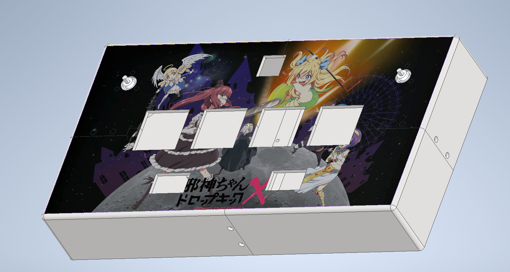
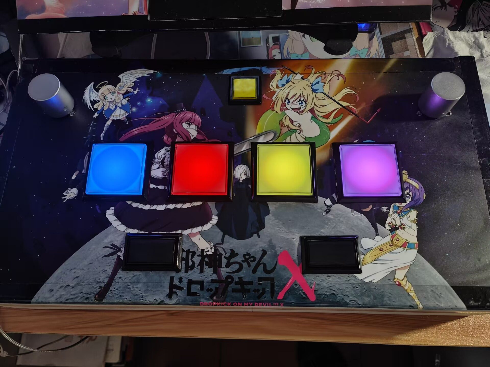

# Ag.S.D.V.X.

## 总览

- SDVX Controller
  Inspired by another repository AGEKI
- ~丐版SDVX手台~

| 主要配件  | 采购                     | 数量  |
|:-----:|:----------------------:|:---:|
| 按键    | 喵呜手台店SDVX按键一套          | 1   |
| 微动开关  | HONEYWELL V15S05-EZ025 | 6   |
| 旋转编码器 | 增量式旋转编码器400p           | 2   |
| 旋钮    | 30*30全铝旋钮              | 2   |
| 主控板   | nano CH32V305          | 1   |
| 机壳    | 3D打印                   | 1   |

## 更新履历

- [x] 定时器编码器模式读取旋转编码器（精度高，稳定）
- [x] USB 报告描述符修改完成
- [x] 适配spicecfg
- [x] 组装
- [ ] 改进旋钮
- [x] 添加灯带
- [x] 外壳改进
- [x] 添加灯光颜色配置接口
- [ ] 配置GUI界面

## 预览

- 机壳

- 灯光配置锐意制作中

- 
